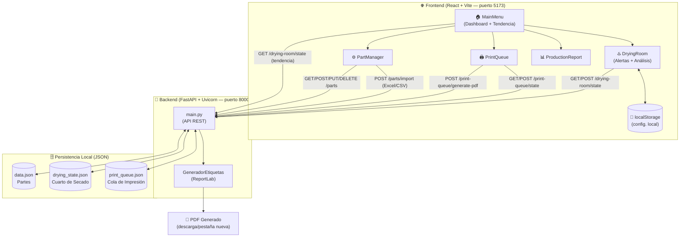

# 🏭 Sistema de Gestión de Etiquetas y Cuarto de Secado

Una aplicación web moderna y responsiva para la administración industrial de números de parte, generación en lote de etiquetas PDF, control logístico del Cuarto de Secado y reportes de producción por turno.

---

## 🚀 Características Principales

El sistema cuenta con **4 módulos** accesibles desde un menú principal, más un **dashboard** con análisis en tiempo real.

---

### 🏠 Dashboard (Menú Principal)
- Tarjetas de acceso rápido a todos los módulos.
- **📈 Tendencia por Número de Parte** del Cuarto de Secado, directamente visible en el panel:
  - Gráfica de barras SVG con piezas producidas por parte (sin librerías externas).
  - Filtro por rango de días: **Hoy / Últimos 7 días / Últimos 30 días**.
  - Filtro por turno: **Ambos / Día / Noche**.
  - KPIs: Total piezas, total lotes, partes distintas.
  - Tabla de ranking con proporción porcentual por parte.
- Indicador de estado del backend (online/offline) con verificación automática cada 30 s.

---

### ⚙️ 1. Gestión de Partes
- CRUD completo (Crear, Leer, Actualizar y Borrar) de números de parte.
- Importación masiva desde archivos **Excel** (`.xlsx`) o **CSV**.
- Campos por parte: Número de Parte, Descripción, Línea, ID, Cantidad por Etiqueta, Cliente (LG), Ayuda Visual.
- Exportación del catálogo completo a CSV.
- Selección visual para agregar partes directamente a la cola de impresión.

---

### 🖨️ 2. Cola de Impresión
- Creación de lotes de etiquetas con número de etiquetas y turno personalizable.
- Generación de PDFs con **4 etiquetas de 6×5 pulgadas por hoja** en orientación horizontal.
- Cada etiqueta incluye: logo, fecha, turno, número de parte, descripción, cantidad, línea, cliente y **2 códigos QR**.
- Auto-limpieza de la cola tras la generación exitosa.
- Apertura automática del PDF en una nueva pestaña del navegador.
- Persistencia de la cola en disco (`print_queue.json`).

---

### ♨️ 3. Control Cuarto de Secado
- Registro de entrada y salida de carritos mediante escaneo de códigos (compatible con lector de código de barras físico).
- Envío automático por tiempo de inactividad al escribir (400 ms).
- Flujo **FIFO** para dar salida siempre a los carritos más antiguos.

#### 🔴 Alertas de tiempo
| Alerta | Descripción |
|---|---|
| **Tiempo Vencido** | Configura los minutos máximos en secado desde la cabecera. Carritos que superen el límite se marcan con fondo rojo + badge `🔴 VENCIDO`. El KPI "Tiempo Vencido" pulsa en rojo. |
| **Salida Anticipada** | Si un carrito sale **10 o más minutos antes** del promedio histórico de esa parte, se lanza un toast de advertencia indicando cuántos minutos antes fue la salida. |
| **Rezago** | Carritos que permanecen de un turno al siguiente se marcan con `⚠️ REZAGO`. |

#### 📊 KPIs visuales (4 tarjetas)
- En Secado — Carritos activos + rezagos del turno anterior.
- ⏰ Tiempo Vencido — Carritos que superaron el límite configurado.
- Entradas Totales — Lotes registrados en la sesión.
- Salidas Completadas — Lotes finalizados.

#### 🔬 Análisis de Tiempos por Parte (panel colapsable)
- Estadísticas por número de parte usando solo registros finalizados:
  - **Mínimo, Promedio, Máximo** de tiempo en secado.
  - **Desviación estándar** del proceso.
  - **Semáforo de estabilidad**: 🟢 Estable (<5 min desv.) · 🟡 Variable (5–15 min) · 🔴 Inestable (>15 min).
  - Contador de **salidas anticipadas** por parte.
- KPIs globales: partes analizadas, total muestras, promedio global, total salidas anticipadas.

#### Otros
- Historial de turnos con retención de **30 días**.
- Filtros por N° parte, máquina y fecha.
- Exportación a CSV del historial activo o filtrado.
- Timer en vivo por carrito (se actualiza cada 30 s).
- Persistencia del estado en disco (`drying_state.json`).
- Reset completo con doble confirmación de seguridad.

---

### 📊 4. Reporte de Producción
- Visualización del historial de registros del Cuarto de Secado.
- Filtros por fecha y turno.
- KPIs: Total piezas producidas y total lotes.
- Agrupación de producción por parte, turno y fecha.
- Exportación a CSV.

---

## 🛠️ Stack Tecnológico

### Frontend
| Tecnología | Versión | Uso |
|---|---|---|
| React | ^19 | UI y gestión de estado |
| Vite | ^8 | Entorno de desarrollo y bundler |
| Tailwind CSS | ^4 | Estilos utilitarios |
| SVG nativo | — | Gráficas de barras (sin librerías externas) |
| `localStorage` | — | Persistencia de configuración local |

### Backend
| Tecnología | Versión | Uso |
|---|---|---|
| FastAPI | latest | Framework de la API REST |
| Uvicorn | latest | Servidor ASGI |
| Pydantic | latest | Validación de datos |
| Pandas | latest | Lectura de archivos Excel/CSV |
| OpenPyXL | latest | Soporte `.xlsx` para Pandas |
| ReportLab | latest | Generación de PDF y códigos QR |
| python-multipart | latest | Soporte para carga de archivos |

---

## 🗂️ Arquitectura del Sistema



---

## 📁 Estructura del Proyecto

```
mi-sistema-etiquetas/
├── backend/
│   ├── main.py               # API FastAPI (todos los endpoints)
│   ├── data.json             # Base de datos de partes (auto-generado)
│   ├── drying_state.json     # Estado del cuarto de secado (auto-generado)
│   ├── print_queue.json      # Cola de impresión persistida (auto-generado)
│   ├── Logo.png              # Logo para las etiquetas PDF
│   └── requirements.txt      # Dependencias de Python
├── src/
│   ├── components/
│   │   ├── MainMenu.jsx      # Dashboard principal + gráfica de tendencia
│   │   ├── PartManager.jsx   # Módulo de gestión de partes
│   │   ├── PrintQueue.jsx    # Módulo de cola de impresión
│   │   ├── DryingRoom.jsx    # Módulo del cuarto de secado (alertas + análisis)
│   │   └── ProductionReport.jsx # Módulo de reporte de producción
│   ├── hooks/
│   │   └── useToast.js       # Hook y provider de notificaciones toast
│   ├── api.js                # Configuración base de la API (URL)
│   ├── App.jsx               # Componente raíz y navegación
│   ├── main.jsx              # Punto de entrada de React
│   └── index.css             # Estilos globales
├── public/                   # Activos estáticos
├── index.html                # HTML base
├── package.json              # Dependencias de Node.js
├── vite.config.js            # Configuración de Vite
├── start.bat                 # Script de inicio rápido (Windows)
└── README.md
```

---

## ⚙️ Instalación y Ejecución

### Prerrequisitos
- **Python 3.9+** — [python.org](https://www.python.org/downloads/)
- **Node.js 18+** — [nodejs.org](https://nodejs.org/)

---

### 🖥️ Inicio Rápido (Windows)

Ejecuta el archivo `start.bat` en la raíz del proyecto. Abrirá automáticamente el backend y el frontend en ventanas separadas y lanzará el navegador.

```
start.bat
```

---

### Manual: Backend (FastAPI)

1. Navega a la carpeta `backend`:
   ```bash
   cd backend
   ```

2. Instala las dependencias de Python:
   ```bash
   pip install -r requirements.txt
   ```

3. Inicia el servidor:
   ```bash
   uvicorn main:app --reload --port 8000
   ```

> ✅ API disponible en: `http://localhost:8000`  
> 📄 Documentación interactiva (Swagger): `http://localhost:8000/docs`

---

### Manual: Frontend (React + Vite)

1. Desde la raíz del proyecto, instala las dependencias de Node:
   ```bash
   npm install
   ```

2. Inicia el servidor de desarrollo:
   ```bash
   npm run dev
   ```

> ✅ Interfaz disponible en: `http://localhost:5173`

---

## 🔧 Configuración de Entorno

Para cambiar la URL del backend (ej. al desplegar en un servidor), crea un archivo `.env` en la raíz del proyecto:

```env
VITE_API_URL=http://TU_SERVIDOR:8000
```

Si esta variable no está definida, la aplicación usa `http://localhost:8000` por defecto.

La configuración del **tiempo máximo de secado** se guarda automáticamente en `localStorage` del navegador por máquina.

---

## 📡 Endpoints de la API

| Método | Ruta | Descripción |
|---|---|---|
| `GET` | `/parts` | Obtiene todos los números de parte |
| `POST` | `/parts/{part_number}` | Agrega un nuevo número de parte |
| `PUT` | `/parts/{old_part_number}` | Edita una parte existente |
| `DELETE` | `/parts/{part_number}` | Elimina una parte |
| `POST` | `/parts/import` | Importa partes desde Excel o CSV |
| `POST` | `/print-queue/generate-pdf` | Genera el PDF de etiquetas |
| `GET` | `/print-queue/state` | Obtiene la cola de impresión guardada |
| `POST` | `/print-queue/state` | Guarda el estado de la cola |
| `GET` | `/drying-room/state` | Obtiene el estado del cuarto de secado |
| `POST` | `/drying-room/state` | Actualiza el estado del cuarto de secado |

---

## 📋 Formato del Archivo de Importación (Excel/CSV)

El archivo debe contener las siguientes columnas con exactamente estos nombres:

| Columna | Obligatorio | Descripción |
|---|---|---|
| `Número de Parte` | ✅ Sí | Identificador único de la pieza |
| `Descripción` | No | Descripción de la pieza |
| `Línea` | No | Línea de producción |
| `ID` | No | Identificador interno |
| `Cantidad` | No | Cantidad por etiqueta |
| `Cliente (LG)` | No | Código de cliente |
| `Ayuda Visual` | No | URL o referencia de imagen de apoyo |

---

## 🔔 Lógica de Alertas

### Salida Anticipada del Cuarto de Secado

Cuando se registra una **SALIDA**, el sistema calcula automáticamente:

```
promedio_histórico = avg(tiempoMinutos de todos los registros FINALIZADOS de esa parte)

si (promedio_histórico - tiempo_actual) ≥ 10 minutos → ALERTA
```

- El toast de alerta dura **8 segundos** y muestra el tiempo real, el promedio y la diferencia.
- El registro queda marcado como `earlyExit: true` para el panel de análisis.
- Requiere al menos **1 registro histórico** de esa parte para activarse.

### Tiempo Vencido en Secado

```
si tiempo_en_secado_actual ≥ maxDryingMins (configurable, default 60 min) → VENCIDO
```

- El valor `0` desactiva la alerta de tiempo vencido.
- La configuración se guarda por navegador (localStorage).
